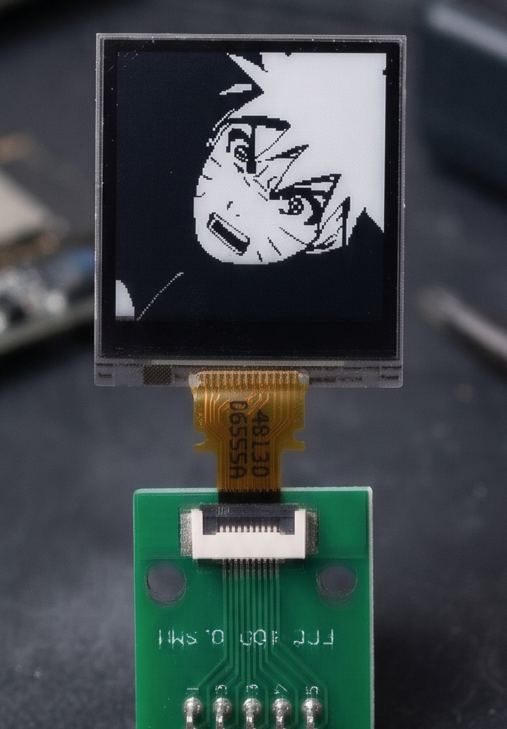

# LS013B7DH03 Display Driver



[English](#english) | [Português](#português)

---

## English

A modular, lightweight, and hardware-independent C driver for the Sharp Memory LCD LS013B7DH03 (128x128 pixels).

This project was designed with portability in mind, allowing simple integration into any microcontroller (STM32, ESP32, AVR, RP2040, etc.) by implementing a thin Hardware Abstraction Layer (HAL/Interface).

### Key Features

- **Architecture Independent**: No direct dependencies on specific hardware vendor libraries.
- **Lightweight & Efficient**: Low RAM consumption and optimized buffer manipulation routines.
- **Software VCOM Management**: Handles the VCOM toggle automatically via software commands, eliminating the need for an external PWM pin.
- **Partial Update Support**: Refresh specific lines to save processing time and power.
- **Integrated GFX Library (Optional)**: Includes a minimalist graphics extension for drawing pixels, characters, strings, and bitmaps.

### Project Structure

```text
├── src/           # Driver core (LS013B7DH03 communication protocol)
├── interface/     # Hardware interface templates (SPI, GPIO, Delay)
├── example/       # High-level basic API for immediate use
├── extension/     # Optional graphics extensions (GFX)
└── test/          # Hardware and display validation routines
```

### How to Integrate

#### 1. Implement the Hardware Interface
The driver communicates via function pointers. You must map your microcontroller's SPI and GPIO functions in the `interface/driver_ls013b7dh03_interface.c` file.

Example for STM32 (using HAL):
```c
uint8_t ls013b7dh03_interface_spi_write(uint8_t *buf, uint16_t len) {
    return HAL_SPI_Transmit(&hspi1, buf, len, HAL_MAX_DELAY) == HAL_OK ? 0 : 1;
}

void ls013b7dh03_interface_cs_control(uint8_t state) {
    HAL_GPIO_WritePin(GPIOA, GPIO_PIN_4, state ? GPIO_PIN_SET : GPIO_PIN_RESET);
}
```

#### 2. Basic Usage Flow
```c
#include "driver_ls013b7dh03_basic.h"

uint8_t frame_buffer[2048]; 

int main(void) {
    ls013b7dh03_basic_init(frame_buffer);
    ls013b7dh03_basic_clear();
    
    // ... manipulate frame_buffer ...
    
    ls013b7dh03_basic_refresh();
}
```

---

## Português

Um driver C modular, leve e independente de hardware para o display Sharp Memory LCD LS013B7DH03 (128x128 pixels).

Este projeto foi desenhado com foco em portabilidade, permitindo a integração em qualquer microcontrolador (STM32, ESP32, AVR, etc.) de forma simples, exigindo apenas a implementação de uma fina camada de abstração de hardware (HAL/Interface).

### Características Principais

- **Independente de Arquitetura**: Sem dependências diretas de bibliotecas de fabricantes de hardware.
- **Leve e Eficiente**: Baixo consumo de RAM e rotinas otimizadas para manipulação do buffer.
- **Gerenciamento de VCOM via Software**: Realiza o toggle do VCOM automaticamente via comandos, dispensando o uso de um pino de PWM externo.
- **Suporte a Atualização Parcial**: Atualize apenas linhas específicas do display para economizar tempo de processamento e energia.
- **Biblioteca Gráfica Integrada (Opcional)**: Inclui uma extensão (GFX) minimalista para desenho de pixels, caracteres, strings e bitmaps.

### Estrutura do Projeto

```text
├── src/           # Core do driver (protocolo de comunicação LS013B7DH03)
├── interface/     # Templates de interface de hardware (SPI, GPIO, Delay)
├── example/       # Exemplo de API de alto nível para uso imediato
├── extension/     # Extensões gráficas opcionais (GFX)
└── test/          # Rotinas de validação de hardware e display
```

### Como Integrar ao seu Projeto

#### 1. Implemente a Interface de Hardware
O driver chama funções através de ponteiros. Você deve mapear as funções de SPI e GPIO do seu microcontrolador no arquivo `interface/driver_ls013b7dh03_interface.c`.

#### 2. Fluxo Básico de Uso
Após implementar as funções da interface, o uso do display torna-se transparente:

```c
#include "driver_ls013b7dh03_basic.h"

uint8_t frame_buffer[2048]; 

int main(void) {
    ls013b7dh03_basic_init(frame_buffer);
    ls013b7dh03_basic_clear();
    ls013b7dh03_basic_refresh();
}
```

---

## License / Licença

Distributed under the MIT License. See `LICENSE` for more information.
Distribuído sob a licença MIT. Veja o arquivo `LICENSE` para mais detalhes.
